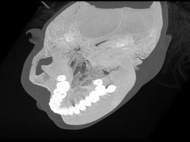
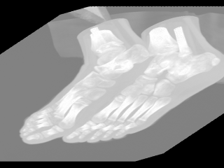
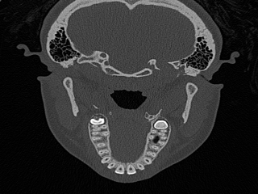
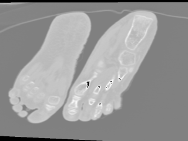

Spookfish
=========

Application for viewing 3D images in uncompressed DICOM format.

To smoothly render 3D images application uses parallel processing on GPU. 

3D view
-------------
You can rotate image into arbitrary angle by holding LMB (left mouse button) and dragging cursor in any direction

 

2D slice view
-------------
At any moment you can switch to slice view mode with hitting the space bar and examine each individual slices by 
holding RMB (right mous button) and dragging mouse cursor from top to bottom

YouTube demo
------------
Find out more about application from this short demo
[Spookfish app](https://www.youtube.com/watch?v=7HIZZk5WnBY)